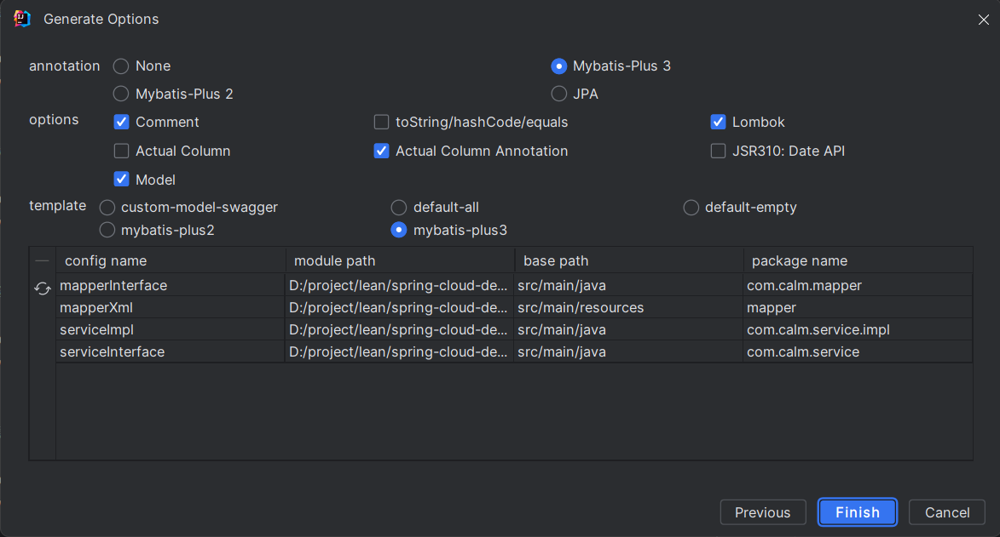

spring-cloud 测试
springboot 2.2.2
spring-cloud H.x
建议查看springboot 和 spring-cloud 最新文档

### swagger地址
http://localhost:port/doc.html#/home

### 自动生成代码(关键点还是在生成模板上，可以学习Freemarker)
#### 方式1：payment-serve-8091中写了一个接口，调用接口即可，参考：https://baomidou.com/pages/779a6e/#%E5%BF%AB%E9%80%9F%E5%85%A5%E9%97%A8
#### 方式2：安装mybatis plus和 database插件,可以看看Scratches and Consoles下的模板文件
就算不学习也可以看懂，参考：https://baomidou.com/pages/ba5b24/#%E5%8A%9F%E8%83%BD
